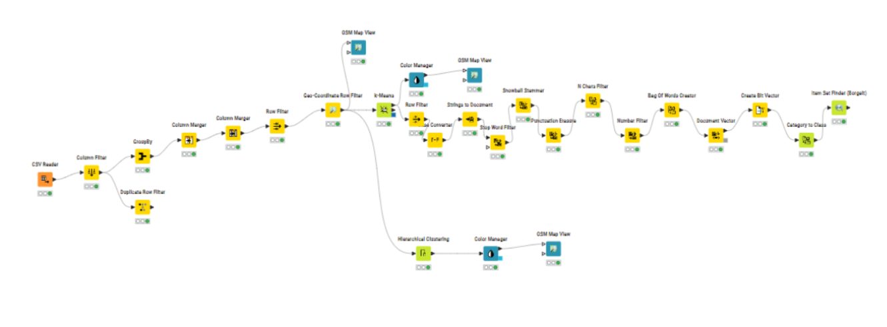

# Analyse des médias géo-localisés à Rennes – KNIME

Ce projet a été réalisé dans le cadre du cours de Fouille Symbolique de Données (Master MIAGE – Université de Rennes).

## Objectif
Analyser plus de 50 000 photos géo-localisées postées sur Flickr pour découvrir des points d’intérêt à Rennes, à l’aide de techniques de clustering et de fouille de texte.

## Étapes du workflow
- Lecture, nettoyage et filtrage des données (suppression de doublons, filtrage géographique)
- Clustering géographique (K-Means et hiérarchique) pour détecter des zones denses
- Visualisation sur carte OpenStreetMap (via KNIME)
- Prétraitement des tags et titres (stop words, stemming, vectorisation)
- Analyse d’itemsets fréquents pour identifier des motifs par cluster

## Outils & techniques
- KNIME Analytics Platform
- Clustering (K-Means, hiérarchique)
- Text mining (Bag of Words, stemming, filtrage par longueur et ponctuation)
- Visualisation géographique (module OSM)
- Item Set Finder (Borgelt)

## Aperçu du workflow

⚠️ Le fichier `.knwf` nécessite l’installation de l’extension KNIME Open Street Map Integration. Certains nœuds sont inactifs sans cette extension.
